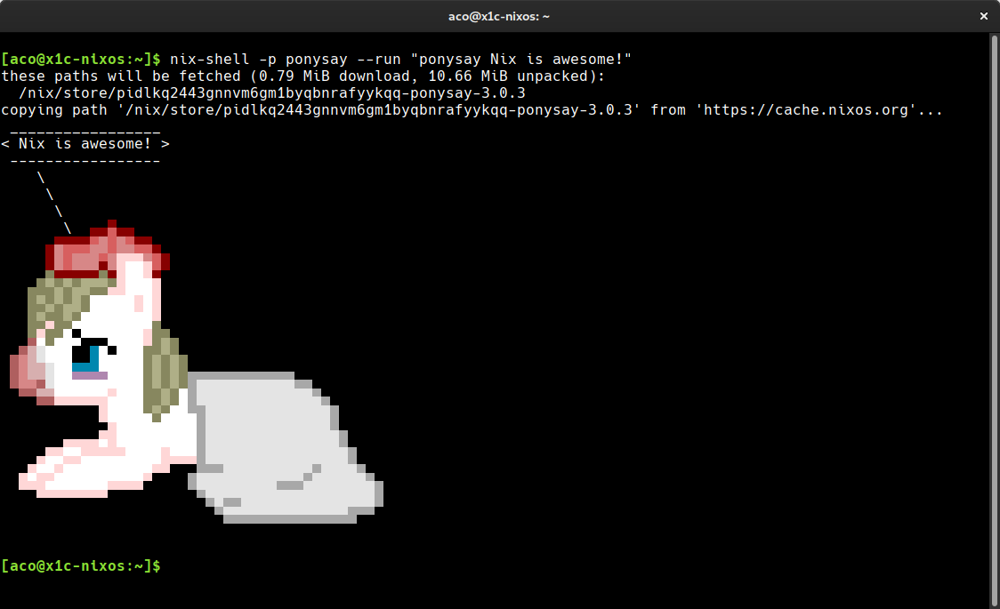

## What is Nix?

> [Nix] is a purely functional package manager.
>
> [Nix]: https://nixos.org/nix/about.html

---

## NixPkgs

https://nixos.org/nixpkgs

---

## Nix shell

{style="background:none; border:none; box-shadow:none;"}

---

```nix
{ nixpkgs ? <nixpkgs>
}:
let
  pkgs = import nixpkgs {};
in
  pkgs.stdenv.mkDerivation {
    name = "my-loveley-pony";
    buildInputs = [ pkgs.ponysay ];
    shellHook = ''
      ponysay "Nix is awesome!"
    '';
  }
```

---

## Nix pills

https://nixos.org/nixos/nix-pills/index.html

---

## NixOS

https://nixos.org/nixos/

---

## NixOps


---

## Questions?

---

## Thank you!

github.com/atopuzov

twitter.com/atopuzov
